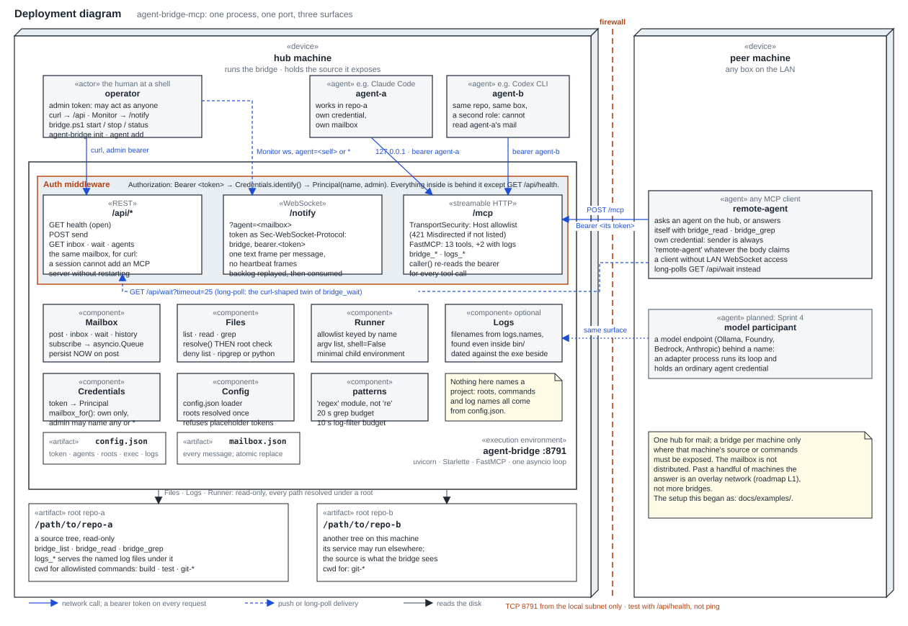
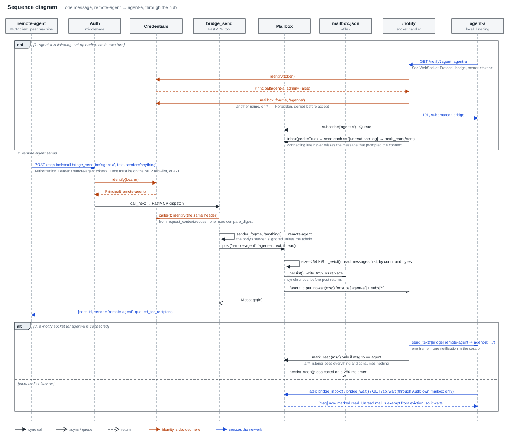
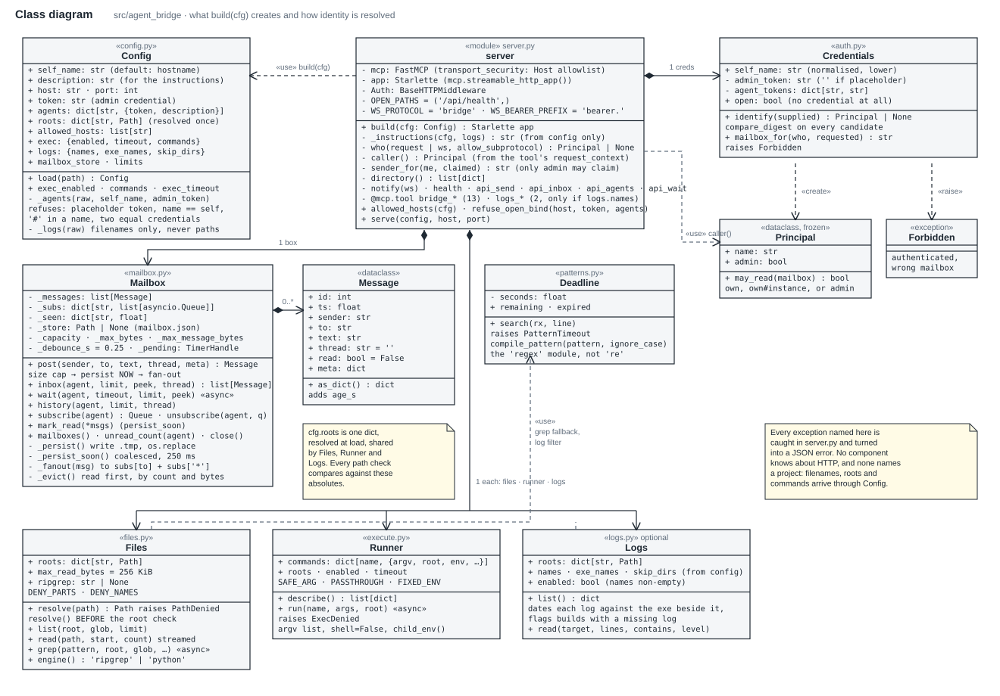

# agent-bridge-mcp

An MCP server that lets coding agents — Claude Code, Codex, a script, on one
machine or several — talk to each other through a durable mailbox, and, more
usefully, lets an agent answer most of its own questions about another
machine's source without waiting for a reply.

It began as a two-machine bridge for one project. Nothing project-specific
remains in the core; that setup lives in [docs/examples/](docs/examples/) as a
worked example, and [docs/ROADMAP.md](docs/ROADMAP.md) is where it is going:
a console, and adapters that put a model endpoint (Ollama, Azure AI Foundry,
AWS Bedrock, the Anthropic API) behind a name like any other agent.

## What it exposes

One process, one port, three surfaces:

- **`/mcp`** — streamable-HTTP MCP for Claude Code on another machine
- **`/notify`** — a WebSocket that pushes each message as one text frame, so a
  listening agent is *told* rather than having to poll
- **`/api/*`** — the same mailbox over plain REST, for an agent that is already
  mid-session and can only reach for `curl`

Tools cover retained messaging, evidence and coordination, alongside read-only
source access and an allowlisted command runner, plus two log tools when the config names log
files.

## Quick start

```powershell
uv venv .venv
uv pip install --python .venv\Scripts\python.exe -e .
.venv\Scripts\agent-bridge init             # writes config.json with the admin token
                                          # then add your roots to it
tools\bridge.ps1 start
tools\bridge.ps1 firewall                 # elevated shell, opens the port to LocalSubnet
```

Then one credential per agent — a role name and a line on what it is:

```powershell
.venv\Scripts\agent-bridge agent add remote-agent --description "Claude Code on the other box"
.venv\Scripts\agent-bridge agent add agent-a      --description "Claude Code in this repo" --local
.venv\Scripts\agent-bridge agent add agent-b      --description "Codex CLI in this repo"    --local
```

Each prints the `claude mcp add` / `codex mcp add` lines to paste where that
agent runs. The token *is* the identity: an agent sends as its own name and
reads only its own mailbox. The admin token from `init` is for you at a shell,
not for an agent.

`curl http://<host>:8791/api/health` needs no token and separates "firewall"
from "wrong token" in one step.

## Design notes

The mailbox commits messages to SQLite before offering live delivery. Existing
`mailbox.json` stores migrate once to `mailbox.sqlite3`; the JSON original is
retained. Message UUIDs and the persistent bridge ID complement legacy integer
IDs. History is retained; `inbox_max` and `mailbox_max_bytes` now limit pending
mail only. A full pending queue rejects new sends instead of deleting evidence.
Storage and migration failures are explicit errors.

Legacy inbox reads and successful `/notify` writes still consume mail. A socket
write proves transport delivery, not model observation. Use history to recover
context. Send `ack_required=true` to protect assignments from consumption until
`bridge_ack(message_id)` or `POST /api/ack {"message_id": "<uid>"}` succeeds.
Receivers can use `ack_mode=true` on MCP inbox/wait or `?ack=explicit` on REST
and WebSocket. `/notify?ack=explicit&format=json` provides structured frames.
Acknowledgment accepts responsibility; it does not prove completion or acceptance.

Containment is the design rather than a wrapper: paths are resolved *before*
they are range-checked against the roots, and the exec allowlist is keyed by
name so a caller never composes a command line.

The evidence protocol adds conversation/check-in links, exact-artifact outcomes,
reviewed learning candidates, telemetry, and advisory path leases. An opt-in
supervised worker can launch a configured harness when mail arrives. See
[the wire contract](docs/wire.md), [wake-up and recovery](docs/wake.md), and
[the implementation review](docs/reviews/implementation.md).

## Architecture

Three original UML views of the core transport, checked in under
[docs/diagrams/](docs/diagrams/). The message sequence illustrates legacy consuming delivery; explicit acknowledgment
and evidence storage are specified in the wire contract.

**Deployment** — where the bridge sits: one process on the hub machine, three
surfaces behind one auth middleware, the source roots it is given, local agents
over loopback and a remote agent across the firewall.



**Message sequence** — what one message goes through: the sender is decided
from the bearer token, never the body; the post is on disk before the call
returns; a connected `/notify` socket consumes it, otherwise it waits in the
inbox.



**Classes** — what `build(cfg)` creates and how identity resolves.



See [CLAUDE.md](CLAUDE.md) for the full reference, the security posture, and the
gotchas that cost real time; [docs/identity.md](docs/identity.md) for what an
agent, a credential and an instance are and why; [docs/threat-model.md](docs/threat-model.md)
for prompt injection, which is the threat this design is actually about.

## Tests

```powershell
.venv\Scripts\python.exe -m pytest tests\ -q
```

## License

MIT
